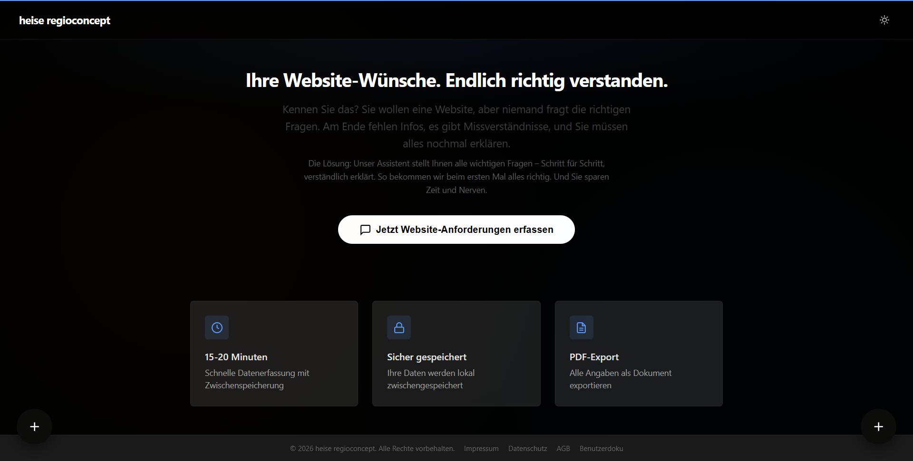
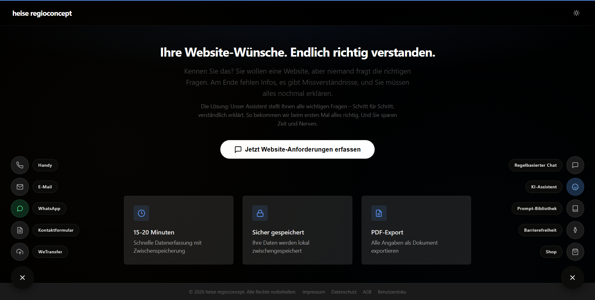
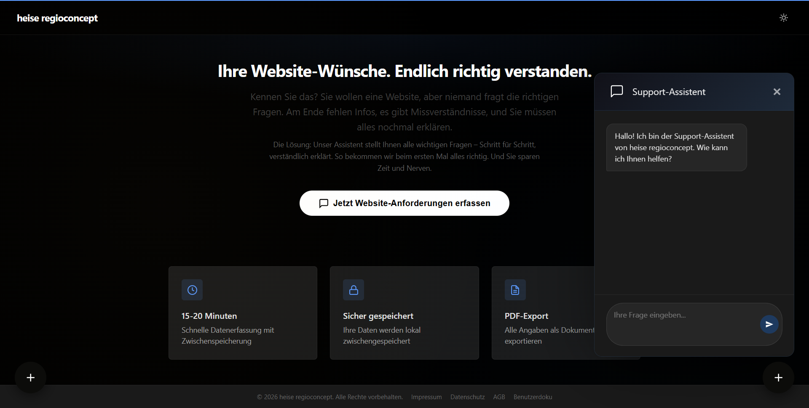
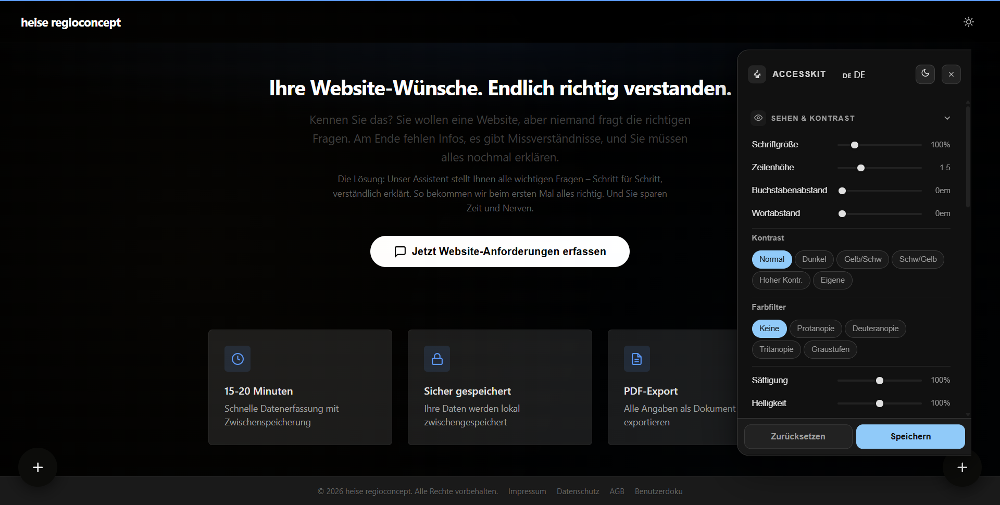
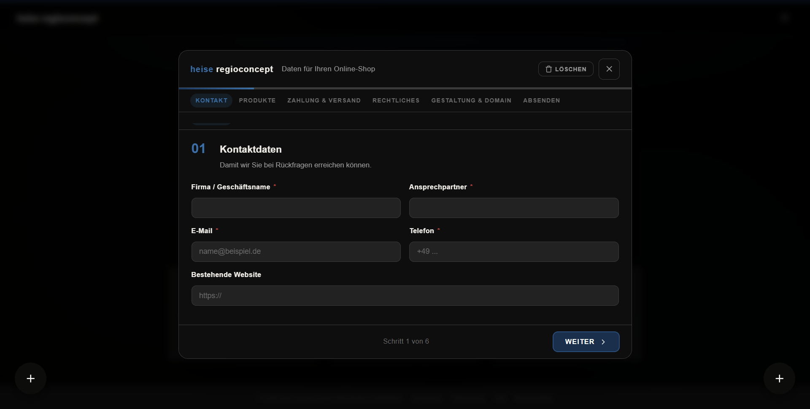

# Chat Assistant für Website Anforderungen

**Ein konfigurierbarer, Web-Assistent zur automatisierten und validierten Erhebung von Website-Anforderungen im KMU-Umfeld.**

---

### Problem

Der bisherige Prozess der Anforderungserhebung bei heise regioconcept basierte auf manuellen, telefonischen Welcome-Calls und unstrukturierten Freitext-Notizen. Dies führte zu signifikanten Ineffizienzen:

* **Datenvollständigkeit**: Nur ca. 40 % der benötigten Informationen lagen nach dem Erstgespräch verwertbar vor.
* **Durchlaufzeiten**: Die Time-to-Live (TTL) bis zur Abnahme lag im Durchschnitt bei ca. 50 Tagen aufgrund fehlender Validierung und wiederholter Korrekturschleifen.
* **Ressourcenbindung**: Die manuelle Erhebung beanspruchte 30–60 Minuten pro Kunde ohne skalierbare Struktur.

### Lösung

Entwicklung eines vollständig clientseitigen, zustandsbasierten Chat-Assistenten, der Kunden asynchron durch einen validierten Abfrage-Flow führt.

* **Deterministische Prozesssteuerung**: Einsatz einer Finite State Machine (FSM) zur Steuerung kontextsensitiver Abfragen (z. B. Domain-Migrationen, Paketgrenzen).
* **In-Line Validierung**: Sofortige Prüfung von Eingaben gegen technische Standards (z. B. RFC 5321 für E-Mails) und gebuchte Paketkontingente.
* **Automatisierter PDF-Export**: Generierung eines strukturierten Übergabeprotokolls direkt im Browser zur nahtlosen Weitergabe an Design und Technik.

### Impact

Die Lösung optimiert die primären Prozess-KPIs durch Standardisierung und Automatisierung:

* **Zeitersparnis**: Reduktion der Erhebungszeit von durchschnittlich 50 Minuten auf 20 Minuten pro Auftrag (entspricht 979,5 Stunden/Jahr).
* **Qualitätssteigerung**: Erhöhung der Datenvollständigkeit bei Übergabe von ca. 40 % auf über 90 %.
* **Wirtschaftlichkeit**: Erwartete jährliche Kostenersparnis von ca. 33.303 € bei einer Amortisationsdauer von nur 26 Tagen.
* **Usability**: Erzielter System Usability Scale (SUS) Score von 84,2 (Benchmark: ≥ 80).

### Tech Stack
* **Framework**: React.
* **Sprachen**: HTML5, CSS3, Vanilla JavaScript (ES6+).
* **Architektur**: Finite State Machine (FSM), Model-View-Update (MVU) Pattern.
* **Persistenz**: Web Storage API (localStorage/sessionStorage), IndexedDB.
* **Security**: DOM-basierte Sanitierung, Content Security Policy (CSP), OWASP ASVS L1.
* **Deployment/Hosting**: heise Server (statisches File-Serving).

### Architektur

Die Anwendung nutzt eine <b>Finite State Machine (FSM)</b> als zentrales Steuerungselement, um den komplexen Abfrage-Flow in 33 deterministische Zustände zu unterteilen und unzulässige Navigation zu verhindern. Durch die strikte Trennung von Geschäftslogik und UI-Schicht (MVU-Pattern) werden Zustandsänderungen deklarativ in den DOM gerendert. Ein integriertes Security-Modul stellt die Eingabesanitierung sicher, indem es die native DOM-API zur Vermeidung von XSS-Vektoren nutzt.

### Screenshots 

  
  
  
  
  

### Status

IHK-Abschlussprojekt Sommer 2026 (Fachinformatiker für Anwendungsentwicklung). Die formale Abnahme durch den Ausbildungsbetrieb erfolgte am 20. März 2026 ohne Mängel.

---

